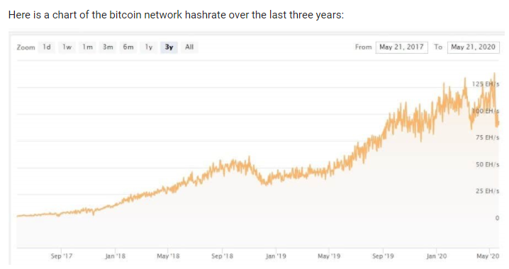

# Blockchain Case Study - Bitfarms Ltd.

## What Is It?
Bitfarms Ltd. of Canada operates as a cryptocurrency mining firm. The Company provides computing power to cryptocurrency networks such as Bitcoin, earning fees from each network for securing and processing transactions 24/7. The mining process deals with the validation of transactions on the Bitcoin network. Miners receive rewards for maintaining the integrity of the network and are incentivized to only generate blocks containing legitimate transactions. Bitfarms serves customers in Quebec. Powered by clean and competitively priced hydroelectricity, Bitfarms operates 5 computing centres in Québec, Canada.

The company was founded in 2017 and is headquartered in Toronto, Canada. It is the first cryptocurrency miner to file a full prospectus with the OSC (TSXV : BITF).

## Operations
In the cryptocurrency mining industry, energy cost and power usage effectiveness have become the single biggest component of operating margins. Daily profitability of an individual server or 'miner' can be derived formulaically based on the efficiency of the equipment. Bitfarms achieves strong returns on invested capital through an emphasis on industrial-scale operational efficiencies, and cost-effective infrastructure build-out through its 100% owned electrical contractor, Volta Electrique. Their data centres are designed, constructed and operated in-house with no reliance on third-party services.

Bitfarms has developed a proprietary monitoring platform that provides live hash power and temperature diagnostics for all miners on 60 second intervals. Underperforming hardware is identified, de-racked and shipped to the repair lab. In March 2018, Bitfarms completed construction of a custom designed micro electronics repair facility in Saint-Jean-sur-Richelieu, Quebec.

## Risky Business
Bitcoin mining stocks are known to be volatile. Bitfarms is currently trading at $0.33 CAD as of October 19th, 2020. This is beacause mining rigs are capital intensive and must be paid for upfront. If the price of bitcoin goes up, or if the bitcoin network hashrate increases, Bitfarms stands to make less money. The rewards given out by the network are fixed at 6.25 bitcoin on average every ten minutes. The more miners on the network, the smaller slice of pie for each mining entity.

In 3 years, from 2017 to 2020, the total computing power of the bitcoin network has grown from 5 EH/s to 95 EH/s, as more mining rigs have been added to the network and more powerful mining rigs have been built. Every month the network hashrate increases, with rare exceptions, like the last six months. For the first four years of its existence, the bitcoin system paid out 50 bitcoin every ten minutes. Four years later it cut production in half to 25. It now stands at 6.25. With rewards cut in half, miners with a higher electricity bill than their peers and/or older mining rigs are forced out of the network.

## Interesting News
On October 13th, 2020 Bitfarms Ltd. announced that it has entered into an equipment lease with BlockFills for 1,000 WhatsMiner M31S miners to be delivered and installed by the end of November 2020. The 1,000 new Miners are in addition to the non-binding Letter of Intent (“LOI”) with Blockfills, announced on September 21, 2020, to lease approximately 7,000 new generation miners with a cost of US$12 to $15 million. The equipment covered by the LOI represents approximately 800 to 840 petahash per second. Petahash [per second] (PH/S) and megawatt (MW) numbers reflect the maximum operational capacity for all ASIC miners. The production cost per bitcoin is calculated by taking the total electricity costs related to the mining of each of Bitcoin  divided by the total number of Bitcoin  mined during  the relevant period.

Bitfarms is striving hard to be cost efficient as well as to achieve vertical integration and operational excellence because that is the only way they will be able to stay in the game. They will be able to survive for the foreseeable future with the investment dollars they are putting in, but their profit and loss statements will finally depend on the price of the Bitcoin itself.

## Resources

* [Bitfarms Website](https://www.bitfarms.com/company/)
* [CDN Blockchain Stocks-2020](https://smallcappower.com/analyst-articles/canadian-blockchain-stocks-2020/)
* [Crypto Mining Stocks](https://smallcappower.com/expert-articles/cryptocurrency-stocks-gains-2020/)