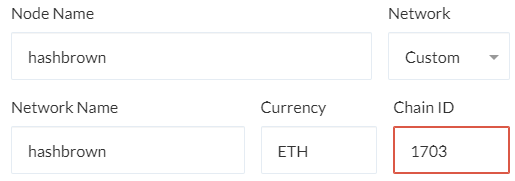
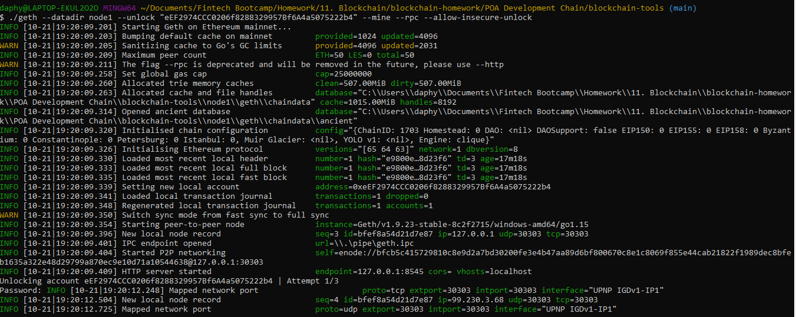
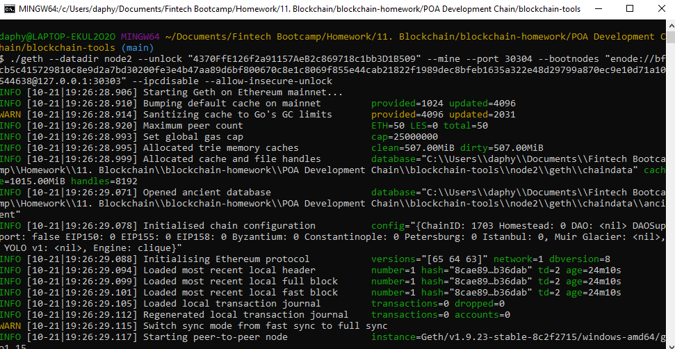
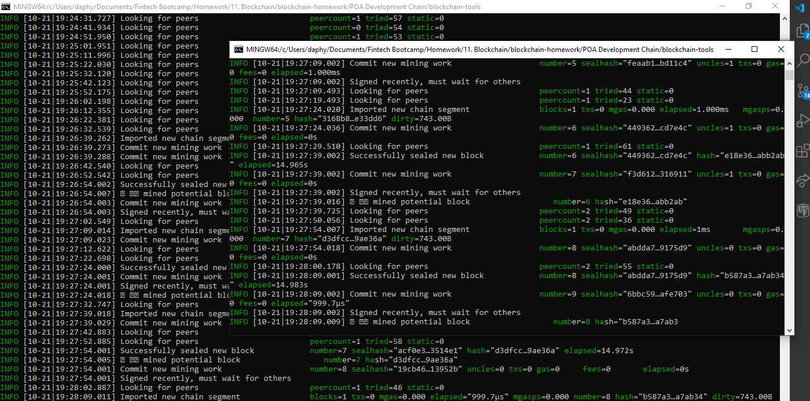
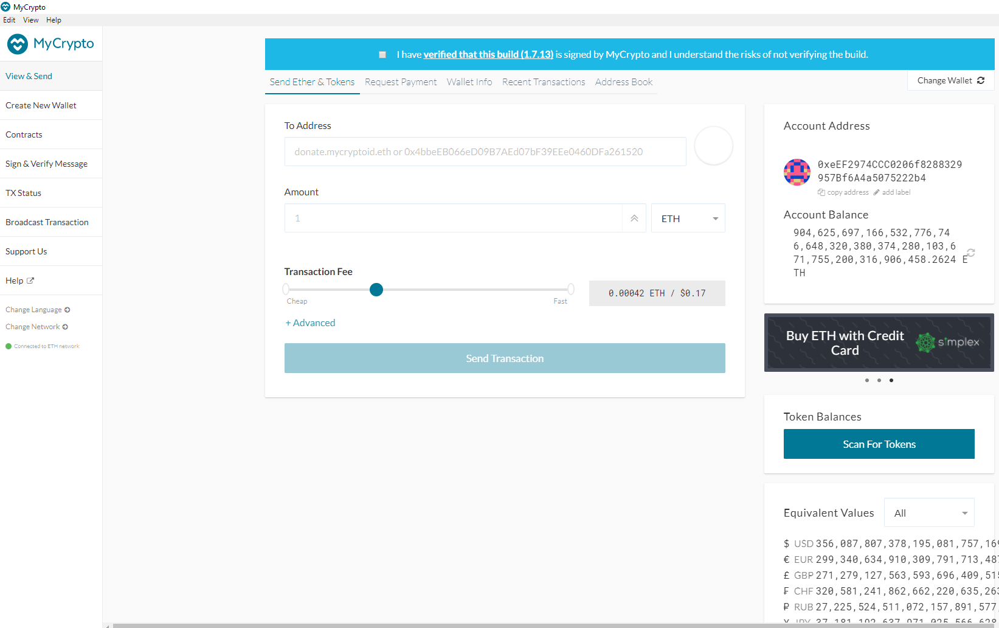
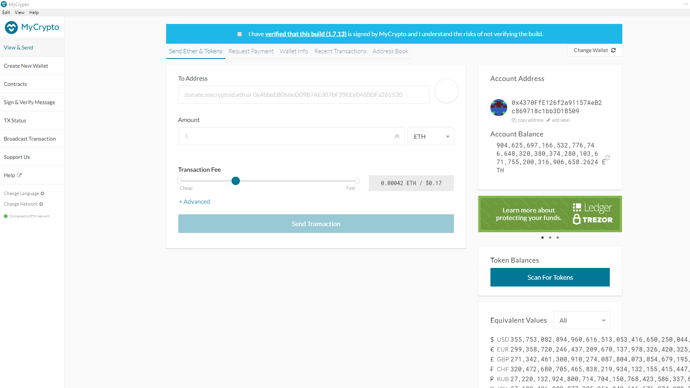
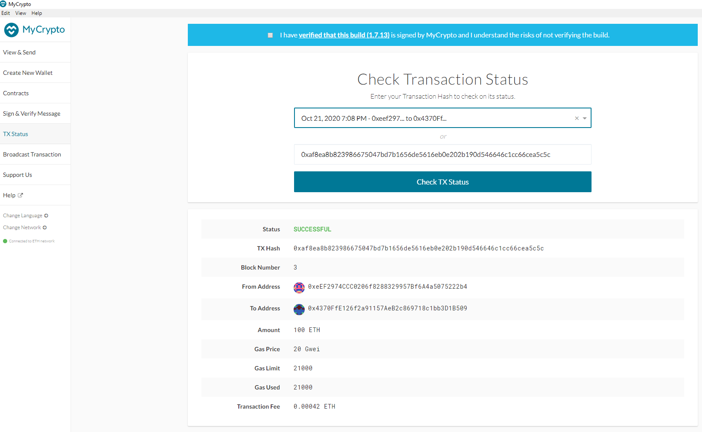

# POA Development Chain

My Server is called hashbrown. The following are the public keys for Node 1 and Node 2:

Node 1 - 0xeEF2974CCC0206f8288329957Bf6A4a5075222b4

Node 2 - 0x4370FfE126f2a91157AeB2c869718c1bb3D1B509

I was able to start both the nodes and successfully mine some coins. I then proceeded to send a transaction from node 1 to 2.

My Custome Node information is as follows:

The status was pending. I stopped running the nodes and then restarted them.

Both nodes restarted successfully and started the mining process once more.

I then logged into my MyCrypto App wallet with my keystore files from node 1 & 2. Both seemes to have a large account balance.

The pending transaction now showed as successful in the TX Status tab.

